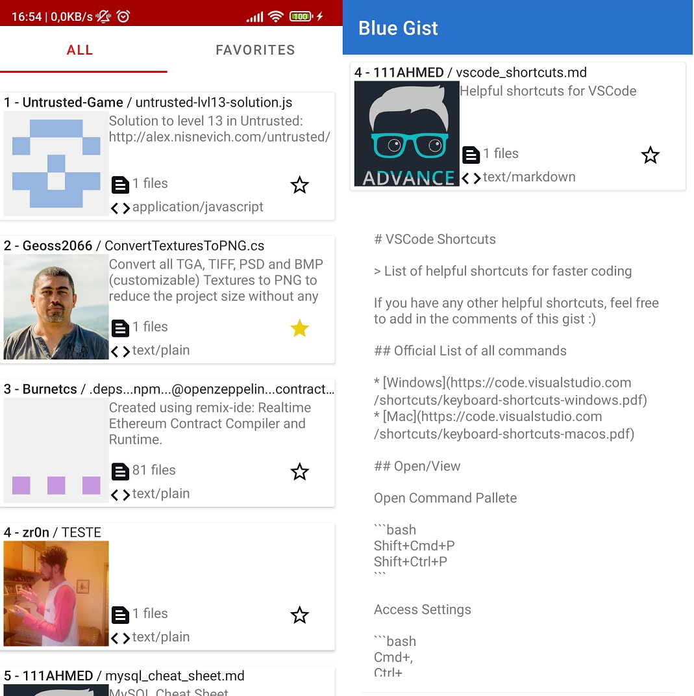
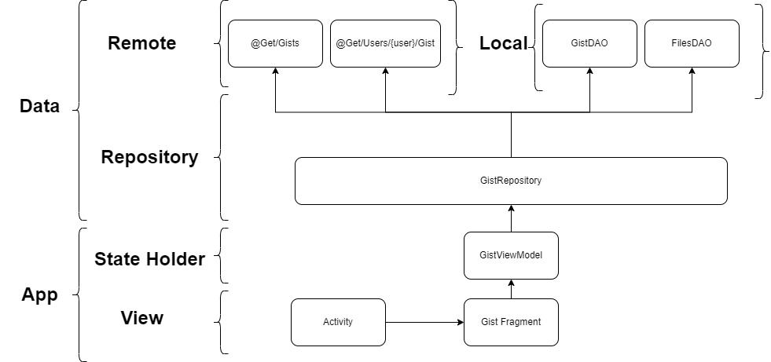
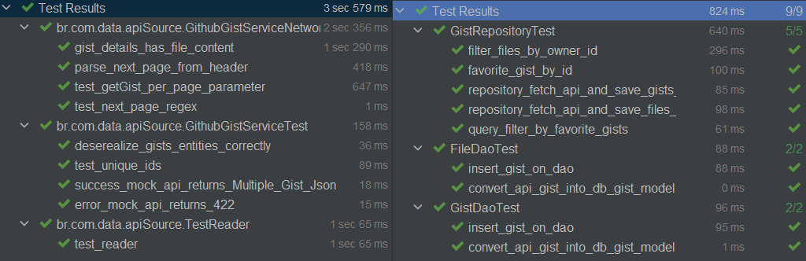

### Freedom Gist

Freedom Gist é um app Android Kotlin consumindo a [api de gists do github]( https://developer.github.com/v3/gists/#list%E2%80%90all%E2%80%90public%E2%80%90gists)

### Features
[X] Lista de gists publicos
[X] Lista de arquivos por gist
[X] Inspecionar conteudo dos arquivos
[X] Favoritar Gists offline
[X] MultiFlavour ( é possível buildar o app Red ou Blue)
[X] Testes Unitários Api
[X] Testes Unitários Banco
[X] Um App bacana

### Arquitetura
A applicação possui uma tela inicial com um scroll infinito para a visualização dos Gists utilizando o [RemoteMediator](https://developer.android.com/topic/libraries/architecture/paging/v3-network-db) para exibir dados paginados salvos localmente no banco de dados, dessa forma a aplicação fica divida confrome o diagrama abaixo.

O repositório possui 2 módulos :
- <b>App</b> : responsável pela camada de UI essa inclui somente as Views(activity e fragmento) e componentes de tela como [ViewPager3](https://developer.android.com/training/animation/screen-slide), e os armazenadores de estados, no caso somente ViewModel.

- <b>Data</b> : responsável pela camada de dados, inclúi todas as classes necessárias para obter dados da api como [Retrofit](https://square.github.io/retrofit/) e para salvar dados localmente com o [Room](https://developer.android.com/training/data-storage/room). A Camada Repository fica responsável por gerenciar as fontes de dados e fornecer uma única fonte dados para o modulo do app.

### Testes
Esta aplicação foi desenvolvida inicialmente somente com o modulo Data, utilizando o TDD para validar as implementações a cada iteração. Por conta disso, a cobertura de testes se encontra exclusivamente neste modulo, nos pontos criticos da aplicação como consultas na api, mockando as respostas com o [MockWebServer](https://github.com/square/okhttp/tree/master/mockwebserver), e as interaçõs com o banco local.

